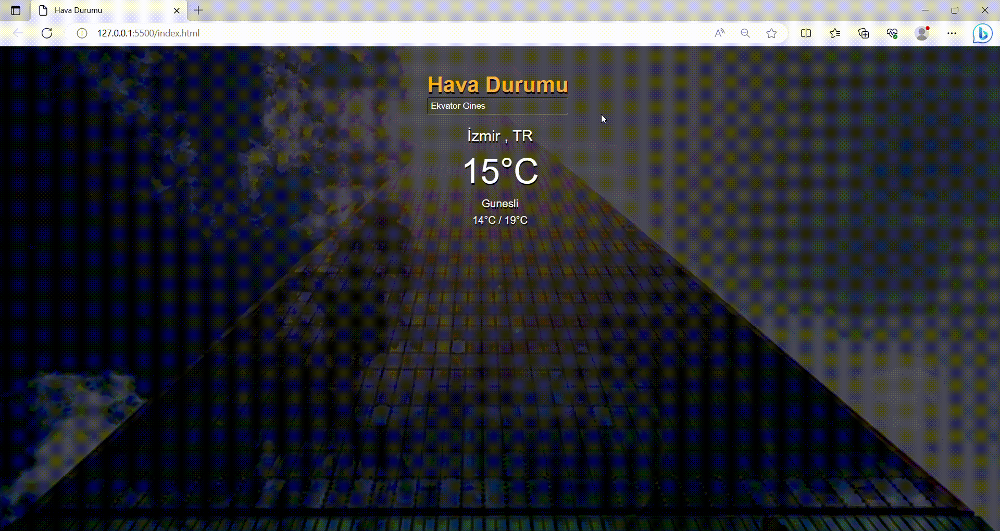

# Weather-App

- Received data from api with fetch.

- Added icon according to weather conditions.

- Is a global weather project.

### 'Deploy'

https://clinquant-unicorn-0a7150.netlify.app

### 'Screen'

